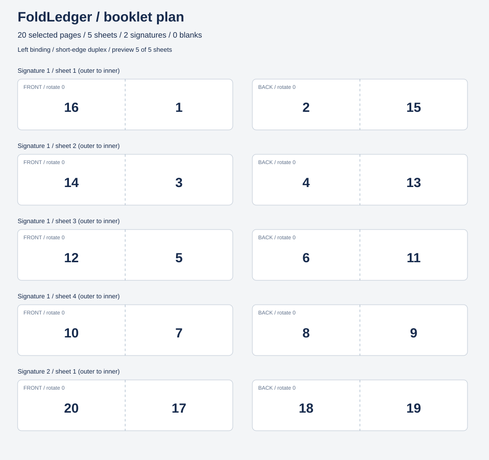

# FoldLedger

**MoonBit 原生的小册子双面打印拼版规划器。** 将讲义、复习资料、社团手册的原始页码，排成可折叠装订的小册子：计算每张纸正反面页序、分册边界、补白和背面旋转，并生成机器可读 JSON 与 SVG 拼版预览。



## 解决什么问题

20 页资料按普通双面打印后直接对折，页序不会正确；按 16 页一册装订，还要分别处理前 16 页和最后 4 页。FoldLedger 把这些决定变成可检查的数据，支持从原稿抽取部分页码、左右装订和两种双面翻转设置。每页出现一次，补白位置可解释，末册仅补到最近的 4 页倍数。

本项目生成 **拼版计划和示意图**，不读取、修改或打印 PDF。PDF 页面合成器可以消费 JSON 的每个 sheet：按 front/back 左右放置原页，0 放空白，背面按 back_rotation 旋转整个画布。当前交付并未实现该合成器。

## 两分钟运行

需要 MoonBit 和 Node.js 22+。本地验证版本：moon 0.1.20260713、Node.js 24.18.0，JS 目标，无第三方库。

```powershell
moon build --target js cmd/main
moon run cmd/main -- --pages 20 --signature 16
moon run cmd/main -- --pages 20 --out plan.json --svg preview.svg
```

输出路径的父目录须已存在；工具拒绝覆盖已有文件。重复演示时使用新文件名。纯 JSON 到标准输出：

```powershell
node _build/js/debug/build/cmd/main/main.js --pages 40 --select "21-24,1" --binding right --duplex long --json
```

8 页左装订小册子的已知参考结果：

| 纸张（外到内） | 正面左 | 正面右 | 背面左 | 背面右 |
| --- | ---: | ---: | ---: | ---: |
| 1 | 8 | 1 | 2 | 7 |
| 2 | 6 | 3 | 4 | 5 |

两面都从各自印刷面的正面观看；这不是透视背面的坐标。将每一册的纸张从外到内套叠后中缝对折。多册是分别折叠的 gathering，不是把所有纸直接套成一个大册。

## 选项与边界

| 选项 | 契约 |
| --- | --- |
| `--pages N` | 必填，原稿页数 1–10,000 |
| `--select "1-8,13-20"` | 可选，默认全选；保留列举顺序；拒绝重复、倒序范围和越界 |
| `--signature N` | 每册最多 N 页，4–64 且为 4 的倍数，默认 16 |
| `--binding left/right` | 默认 left；right 交换每面左右页槽 |
| `--duplex short/long` | 横向纸张翻转边，默认 short；long 要对背面整体旋转 180° |
| `--out PATH` | 完整 JSON 计划，0 表示补白 |
| `--svg PATH` | 最多显示前 24 张纸的预览，标明截断；JSON 永远完整 |
| `--json` | stdout 只输出 JSON，方便管道 |

退出码：0 成功，2 参数、计划或文件错误。所有参数验证完成才写文件；已有输出不会被覆盖。写入中出错会尝试删除本次创建的文件；不是跨文件的崩溃原子事务。

## MoonBit API

其他包在 `moon.pkg` 中导入 `"hua1104/foldledger" @fold` 后：

```moonbit
match @fold.parse_selection("1-8,13-16", 20) {
  Err(message) => println(message)
  Ok(pages) => match @fold.make_plan(20, pages, @fold.default_config()) {
    Err(message) => println(message)
    Ok(plan) => println(@fold.plan_to_json(plan))
  }
}
```

核心数据模型、页码语法、分册算法、补白计算、装订转换和 JSON/SVG 序列化均由 MoonBit 实现。JS FFI 仅处理进程与文件。接口见 `pkg.generated.mbti`；算法说明见 [docs/ALGORITHM.md](docs/ALGORITHM.md)。

## 验证

```powershell
node scripts/verify.mjs
```

脚本逐项执行格式检查、零警告检查、7 个 MoonBit 测试、JS 构建和 9 个 CLI 集成测试，任一步失败即停止。核心测试包含 2,580 组页码守恒/折页配对组合；集成测试包含 10,000 页输入、错误参数、JSON 解析、拒绝覆盖和避免部分输出。

GitHub Actions 已配置，上传前尚未在远端运行。本地仅验证 JS 后端；尝试 WASM-GC 时本机工具链缺少标准库构建产物，因此不把 WASM-GC 列为已验证目标。

## 使用范围

实现的是等宽双页、横向纸张的折叠小册子页码布局，不含裁切出血、爬移补偿、页尺寸、纸张厚度、PDF 合成和打印机驱动。`long/short` 是版面旋转约定，实际纸路可能不同；正式批量打印前先用一张带编号的纸校准。当前未做实体打印验证。

## 原创性与参赛

与图布局审计项目 MoonLayout Audit 的输入、算法和产物不同；与文本脱敏库也无功能关系。标准小册子拼版数学并非本项目发明，项目价值在于 MoonBit 原生的可验证规划 API、页选择/末册补白契约与可视化输出。

已检索公开 GitHub 仓库，未发现 MoonBit 同方向结果；不声称全球无同类，也不能代替主办方查重。证据和同类工具对比见 [docs/RESEARCH.md](docs/RESEARCH.md)。参赛一页说明见 [APPLICATION.md](APPLICATION.md)，发布指令见 [GITHUB_UPLOAD.md](GITHUB_UPLOAD.md)。MIT License。
